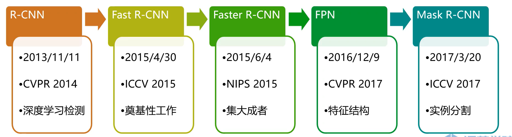
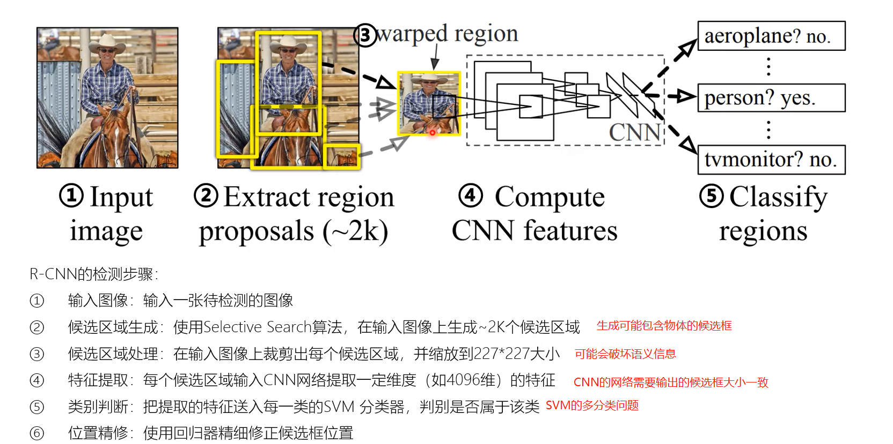
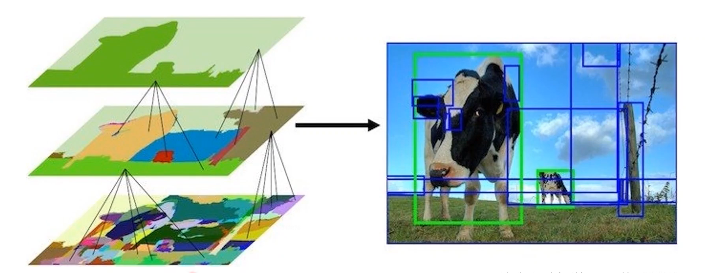
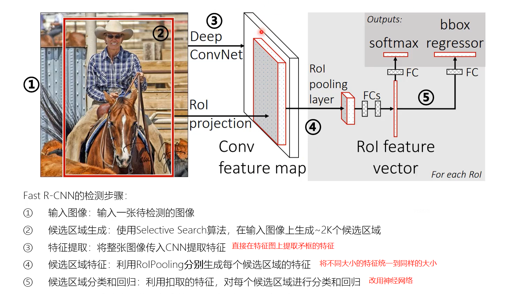
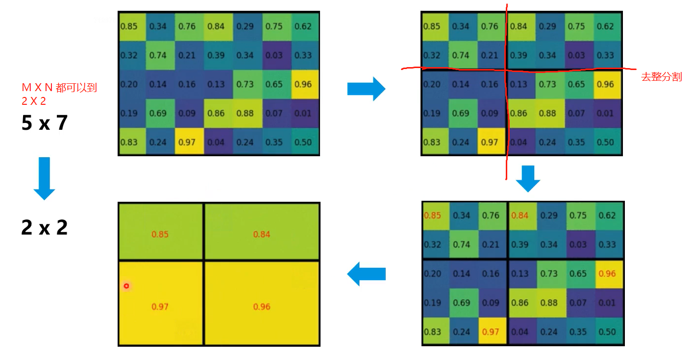
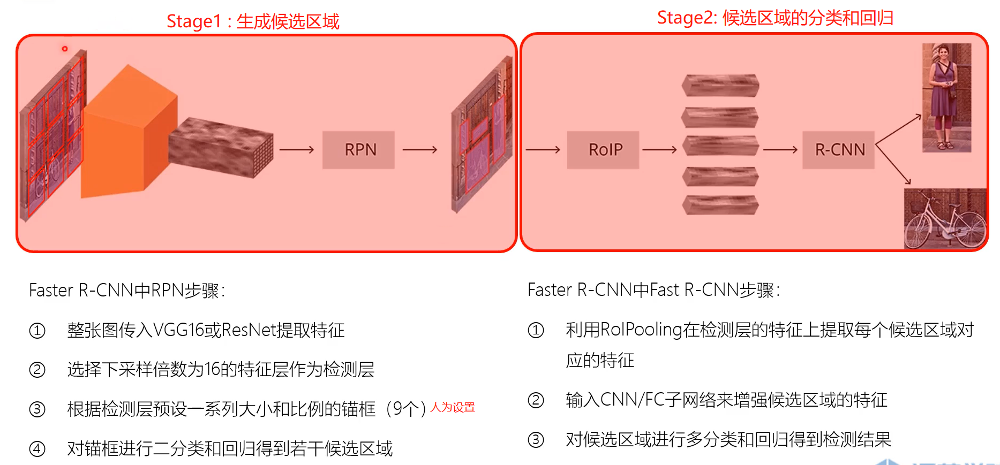
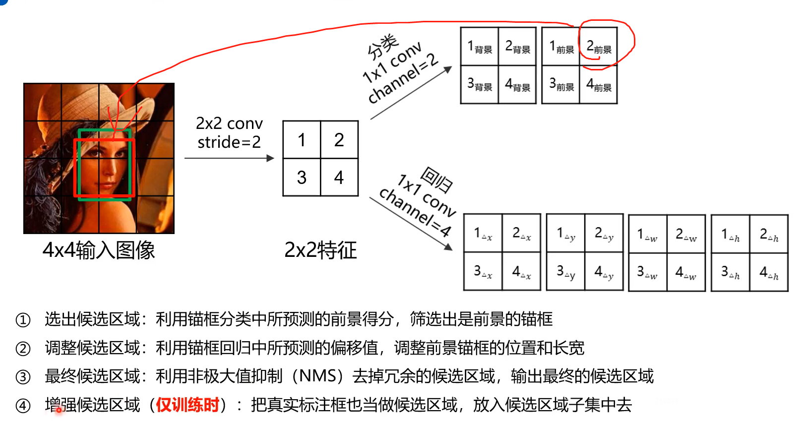
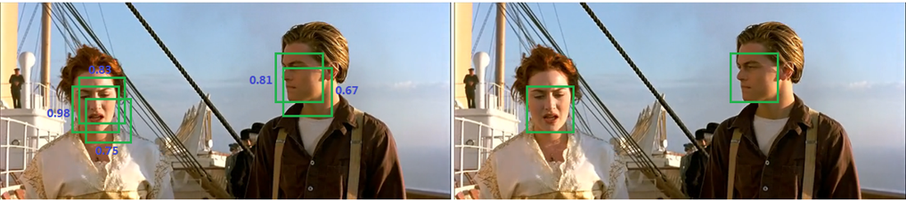
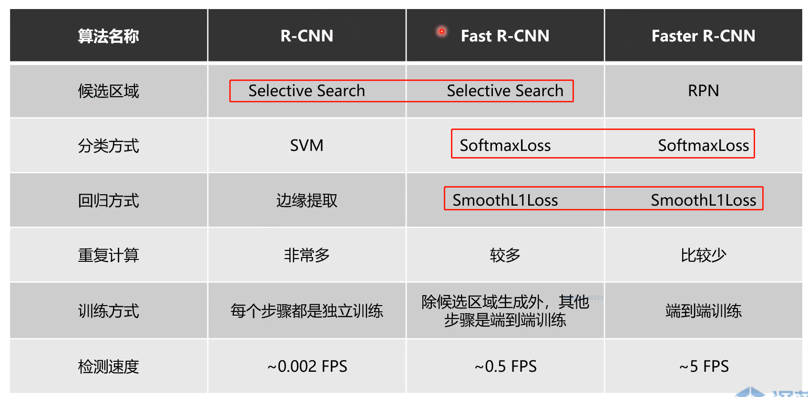
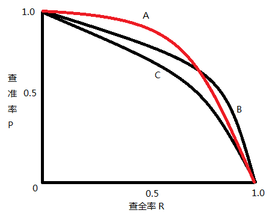

# RCNN 系列

论文链接:[Faster R-CNN: Towards Real-Time Object Detection with Region Proposal Networks ](https://arxiv.org/abs/1506.01497)

Github链接 :[GIthub链接](https://github.com/Victor94-king/ComputerVersion)

CSDN: [victor_manches的博客](https://blog.csdn.net/victor_manches?spm=1000.2115.3001.5343)

 

RCNN系列是物体检测系列的开山之作，本篇文章会主要的介绍下这个系列的特点以及其进化历史，下图是RCNN系列的发展，

 

 

 

## 1. R-CNN

### 原理

 

 

**缺点**

1. **使用Selective Search 非常的耗时** (在faster R-CNN优化)
2. **一张图片上由Selective Search 生成的候选框非常多，存在着大量的重复计算** (在fast R-CNN优化)
3. **特征提取、图像分类、边框回归是三个独立的步骤，要分别训练，效率低下**(在fast R-CNN优化)

 

 

[**Selective Search** ](https://link.springer.com/article/10.1007/s11263-013-0620-5)

生成候选框的流程:

* 利用图像分割产生初始的分割区域 -> 利用相似度进行区域的合并
* 相似度可以利用颜色、纹理、大小和形状交叠的差异进行不同的权重相加

 

 

---

 

## 2. fast R-CNN

### 原理

**相比于R-CNN 主要是针对步骤345进行了更改，加入了ROI Pooling 和利用FCN代替了SVM ， 从而实现了一个端到端的任务训练，相比于前者其速度快了200多倍，但是还是保留了selectIve search算法，耗时依然很慢。**

 

 

### ROI pooling

利用特征采用，把不同大小的空间特征变成大小一致的特征,原因有以下2点:

1. 网络后面接的是一个全连接层，需要输入一致
2. 各个候选区域大小一致，可以组成batch进行处理

 

 

 

---

## 3. faster R-CNN

### 原理

其主要优化就是利用RPN network 替代了之前的Selective Search从而进行了一个完整的端到到的网络

缺点:

* RPN 和NMS 网络耗时
* 矛框需要人为设置
* 是一个两阶段的方法，速度比较慢

 

### RPN(Region Proposal Network)

RPN将经过resnet和vgg16后的得到下采样16倍的特征图后，将特征图的每个像素人为的关联很多个大小长宽比不同的矛框原论文中是9个，然后通过矛框的分类选出前景点(只需要判断是否存在物体，具体的是什么类别由)，再去做矛框的回归(位置修正)。最后得到的经过NMS筛选后的proposal anchor 在原始的特征图上经过投影后给到ROI pooling 去得到相同的输出，最后再给出分类和回归的结果。

具体可以参考这几篇文章，讲得比较清晰：[RPN（区域生成网络）_rpn](https://blog.csdn.net/tony_vip/article/details/108827910)

 

### NMS(非极大值抑制)

目标检测算法中对同一物体可能会出现很多冗余的检测结果，通过NMS可以去除很多冗余的结果，但这个算法也十分的耗时。
算法: 同一目标的置信度从高到低排序，分别计算置信度最高的与剩余的矛框的IOU，删除IOU大于一定阈值。剩下的矛框继续重复以上步骤，最后留下的矛框作为最终输出。 其中IOU的阈值是一个超参数 一般为 0-0.5

---

## 4. 三者对比

总的来说R-CNN系列是基于矛框的物体检测算法的开山之作，很多思想在后面的网络都还能看到，比如说 NMS / ROI pooling ，但是整体两阶段的方法还是太耗时了，所以现在一般都是以单阶段和无矛框的检测为主。而对于矛框的分类和回归可以级联的来做，从而增加精度，典型的代表作比如CascadeNet。

 

 

---

## 5. 物体检测评价指标mAP

mAP -- 对应的就是不同类别下的AP的平均值，那么什么又是AP呢？

| 预测值/ 真实值 | T  | F  |
| -------------- | -- | -- |
| T              | TP | FP |
| F              | FN | TN |

 

首先我们首先要了解几个定义，结合混淆矩阵如上图(TF分别代表的是2分类问题中的是或者不是TP/FP/FN/TN 前面的字母TF 代表的意义是你做2分类有没有对，后面的PN代表的是你预测的值是positive 还是negetive，所以上面的例子比如说FP首先你预测目标是一个posive sample ，然后你做错了所以是False，说明它实际值应该是一个negetive)， 在目标检测中的定义如下

* True Positive (TP): IoU>IOUthreshold  **IOU_{threshold}** (IOUthreshold  **IOU_{threshold}** 一般取 0.5 ) 的[检测框](https://www.zhihu.com/search?q=%E6%A3%80%E6%B5%8B%E6%A1%86&search_source=Entity&hybrid_search_source=Entity&hybrid_search_extra=%7B%22sourceType%22%3A%22answer%22%2C%22sourceId%22%3A993913699%7D)数量（同一 Ground Truth 只计算一次）
* False Positive (FP): IoU<=IOUthreshold  **IOU_{threshold}** 的检测框数量，或者是检测到同一个 GT 的多余检测框的数量
* False Negative (FN): 没有检测到的 GT 的数量
* True Negative (TN): 在 mAP 评价指标中不会使用到

 

基于此我们就得到了两个指标, 精确率和召回率，这两个指标其实是一个需要平衡的值，比如说我所有的目标都预测是positive，那么你的FN = 0 ，因此你的recall 就是100% 说明在真实是positive样本里你都完美查全了，但是我们再看看precision， 此时FP + TP = 100%的样本，此时precision就很小。 反过来也是一样的

* 查准率（Precision）: TP/(TP + FP) = TP / all detections
* 查全率（Recall）: TP/(TP + FN) = TP / all GT

 

而AP就是等于绘制P-R曲线下的面积，具体绘制P-R曲线的方法可以参考这篇知乎: [目标检测中的mAP是什么含义？](https://www.zhihu.com/question/53405779)

