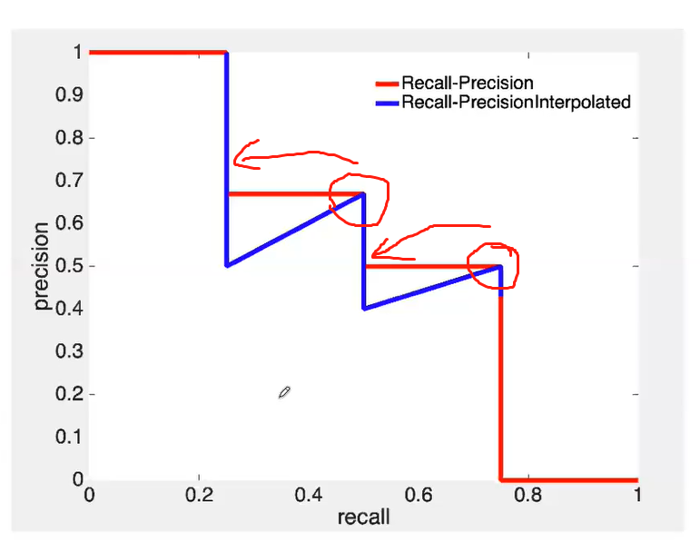

# RCNN 系列

论文链接:[Faster R-CNN: Towards Real-Time Object Detection with Region Proposal Networks ](https://arxiv.org/abs/1506.01497)

Github链接 :[GIthub链接](https://github.com/Victor94-king/ComputerVersion)

CSDN: [victor_manches的博客](https://blog.csdn.net/victor_manches?spm=1000.2115.3001.5343)

 

RCNN系列是物体检测系列的开山之作，本篇文章会主要的介绍下这个系列的特点以及其进化历史，下图是RCNN系列的发展，

 

 

 

## 1. R-CNN

### 原理

 

 

**缺点**

1. **使用Selective Search 非常的耗时** (在faster R-CNN优化)
2. **一张图片上由Selective Search 生成的候选框非常多，存在着大量的重复计算** (在fast R-CNN优化)
3. **特征提取、图像分类、边框回归是三个独立的步骤，要分别训练，效率低下**(在fast R-CNN优化)

 

 

[**Selective Search** ](https://link.springer.com/article/10.1007/s11263-013-0620-5)

生成候选框的流程:

* 利用图像分割产生初始的分割区域 -> 利用相似度进行区域的合并
* 相似度可以利用颜色、纹理、大小和形状交叠的差异进行不同的权重相加

 

 

---

 

## 2. fast R-CNN

### 原理

**相比于R-CNN 主要是针对步骤345进行了更改，加入了ROI Pooling 和利用FCN代替了SVM ， 从而实现了一个端到端的任务训练，相比于前者其速度快了200多倍，但是还是保留了selectIve search算法，耗时依然很慢。**

 

 

### ROI pooling

利用特征采用，把不同大小的空间特征变成大小一致的特征,原因有以下2点:

1. 网络后面接的是一个全连接层，需要输入一致
2. 各个候选区域大小一致，可以组成batch进行处理

 

 

 

---

## 3. faster R-CNN

### 原理

其主要优化就是利用RPN network 替代了之前的Selective Search从而进行了一个完整的端到到的网络，RPN会在下一部分详细介绍

缺点:

* RPN 和NMS 网络耗时
* 矛框需要人为设置
* 是一个两阶段的方法，速度比较慢

 

### RPN(Region Proposal Network)

RPN，全称是候选区域提取网络，其主要的作用是替代传统的select search进行候选框的提取。

首先输入的图像经过resnet和vgg16后的得到下采样16倍的特征图后，将特征图的每个像素人为的关联很多个大小长宽比不同的矛框(原论文中是9个, 长宽比分别是 1:2 , 1:1 , 2:1 )，然后通过矛框的分类选出前景点(只需要判断是否存在物体，具体的是什么类别由后面的分类网络进行处理)。对应上图的第1步。

再去做矛框的回归(位置大小修正)，这是由于初始化的矛框由于下采样的精度损失所以位置和大小都存在不准确的情况，所以在这里经过一次回归对矛框的whxy进行精准的后处理。以上的回归和分类的步骤可以级联的去做，从而精度可以达到更高，但同样速度就会损失。对应图上的第2步。

最后得到的经过NMS筛选后的proposal anchor 在原始的特征图上经过投影后给到ROI pooling 去得到相同的输出，最后再给出分类(具体类别)和回归的结果。对应图上第三步

候选区域增强，是因为在本身训练的时候，矛框的正例本身数量相比于负例就很少，为了数据增强可以把gt直接加入训练集。对应上图第四步。

 

 

下图是原论文中的图，这里我们可以看到作者在卷积后的特征图 H * W * C上进行sliding window 也就是3 * 3 的卷积 ， 这里我觉得是为了加入邻域的信息，随后得到一个与特征图大小相同H * W * 256 维的特征图，每个像素点从原始的C特征向量从而转变成了256维的特征向量，然后做两次 1 * 1 的卷积从而变成H * W * 2k 候选框判断特征图 以及 H * W * 4k的候选框回归的特征图。所以我们可以看到其实就是把每个特征图上的每个像素点，先结合邻域的信息变成256维的特征向量，然后通过mlp(1*1 的卷积可以看成mlp)分别去做分类和回归，从而得到2k个score 和 4k个coordinates。

 

 

### NMS(非极大值抑制)

目标检测算法中对同一物体可能会出现很多冗余的检测结果，通过NMS可以去除很多冗余的结果，但这个算法也十分的耗时。
算法流程:

1. 对于同一类别的候选，按照置信度进行排序放入列表propose_list
2. 取出置信度最高的候选框放入input_list, 并标记当前的候选为pickup_anchor
3. 对propose_list里每一个候选与当前的pickup_anchor计算IOU
4. 对于IOU大于阈值∊的候选可以认为是与当前pickup_anchor重合度较高的候选，所以可以直接从propose_list中删除。剩下的可以看成是与当前pickup_anchor重复度不高的候选，即可能存在其他物体，所以继续留在propose_list里
5. 对于剩下的propose_list(删除当前pickup_anchor与其IOU大于阈值)的，重复步骤234，直至propose_list为空
6. 针对于多类别，重复步骤1-5即可

 

 

从这里可以看出NMS有几个缺点:

* 需要手动设置阈值 --- **Adaptive NMS 通过自适应的方法针对目标大小设置不同的阈值**
* 低于阈值的直接设置为0 --- **Soft NMS & softer NM**S 根据IOU大小进行惩罚衰减
* 只能在CPU上运行，速度成为瓶颈 --- **在Cuda上运行的CUDA NMS ， 更快的fast NMS 以及通过神经网络来实现NMS ， ConvNMS**
* 通过IOU进行评估 --- **DIoU通过融合目标尺度和距离综合考量的指标**

---

## 4. 三者对比

总的来说R-CNN系列是基于矛框的物体检测算法的开山之作，很多思想在后面的网络都还能看到，比如说 NMS / ROI pooling ，但是整体两阶段的方法还是太耗时了，所以现在一般都是以单阶段和无矛框的检测为主。而对于矛框的分类和回归可以级联的来做，从而增加精度，典型的代表作比如CascadeNet。

 

 

---

## 5. 物体检测评价指标mAP

mAP -- 对应的就是不同类别下的AP的平均值，那么什么又是AP呢？

| 预测值/ 真实值 | T  | F  |
| -------------- | -- | -- |
| T              | TP | FP |
| F              | FN | TN |

 

首先我们首先要了解几个定义，结合混淆矩阵如上图(TF分别代表的是2分类问题中的是或者不是TP/FP/FN/TN 前面的字母TF 代表的意义是你做2分类有没有对，后面的PN代表的是你预测的值是positive 还是negetive，所以上面的例子比如说FP首先你预测目标是一个posive sample ，然后你做错了所以是False，说明它实际值应该是一个negetive)， 在目标检测中的定义如下

* True Positive (TP): IoU>IOUthreshold  **IOU_{threshold}** (IOUthreshold  **IOU_{threshold}** 一般取 0.5 ) 的[检测框](https://www.zhihu.com/search?q=%E6%A3%80%E6%B5%8B%E6%A1%86&search_source=Entity&hybrid_search_source=Entity&hybrid_search_extra=%7B%22sourceType%22%3A%22answer%22%2C%22sourceId%22%3A993913699%7D)数量（同一 Ground Truth 只计算一次）
* False Positive (FP): IoU<=IOUthreshold  **IOU_{threshold}** 的检测框数量，或者是检测到同一个 GT 的多余检测框的数量
* False Negative (FN): 没有检测到的 GT 的数量
* True Negative (TN): 在 mAP 评价指标中不会使用到

 

基于此我们就得到了两个指标, 精确率和召回率，这两个指标其实是一个需要平衡的值，比如说我所有的目标都预测是positive，那么你的FN = 0 ，因此你的recall 就是100% 说明在真实是positive样本里你都完美查全了，但是我们再看看precision， 此时FP + TP = 100%的样本，此时precision就很小。 反过来也是一样的

* 查准率（Precision）: TP/(TP + FP) = TP / all detections
* 查全率（Recall）: TP/(TP + FN) = TP / all GT

 

而AP就是等于绘制P-R曲线下的面积，具体绘制P-R曲线的方法可以参考这篇知乎: [目标检测中的mAP是什么含义？](https://www.zhihu.com/question/53405779)

这里简单的描述下:

1. 设定一个IOU阈值 (IOU是用来确定TP 和FP，每一个目标只有一个GT (取与GT最高的IOU为TP)， 小于IOU的就是FP )
2. 将其根据置信度从大到小排列，然后根据不同的每个置信度的作为当前得置信度阈值，计算当前置信度阈值的Precision 和 Recall
3. 得到对应的PR曲线，计算其面积对应的当前类的AP，真实的曲线应该是锯齿状的蓝线，但是实际中采用插值的方法(红线)，取其右侧最高点precision作为插值

   
4. 重复以上步骤计算每一个类的AP，取得平均值mAP

 

 

参考文献:

[\NMS技术总结（NMS原理、多类别NMS、NMS的缺陷、NMS的改进思路、各种NMS方法](https://blog.csdn.net/KANG157/article/details/124649838)
