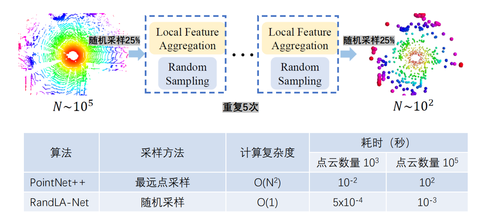
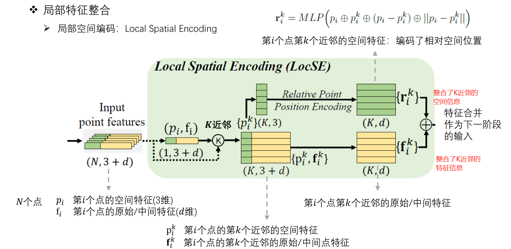
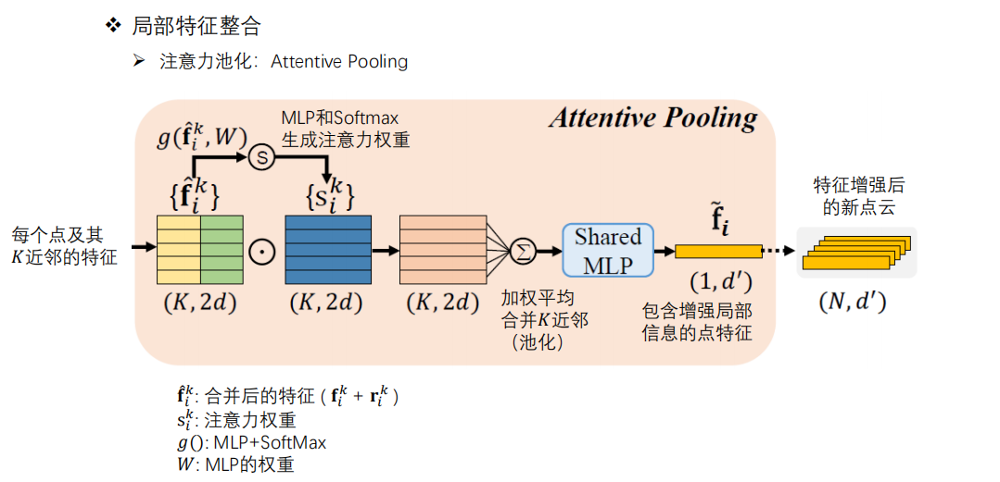
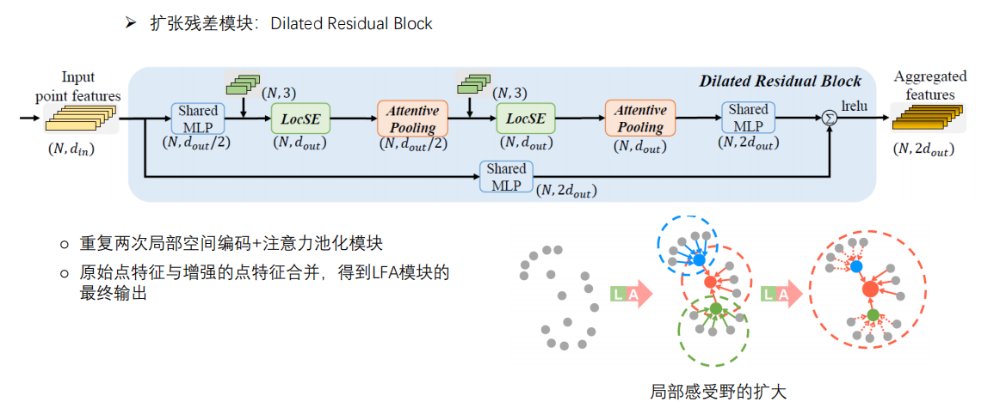
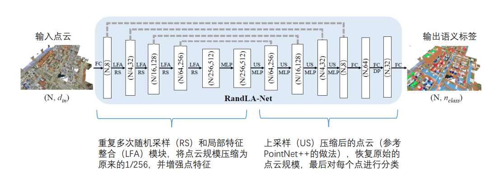
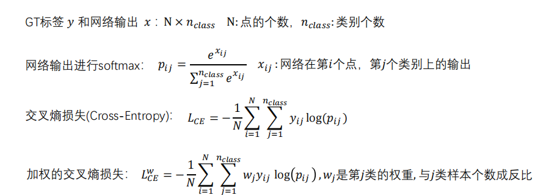
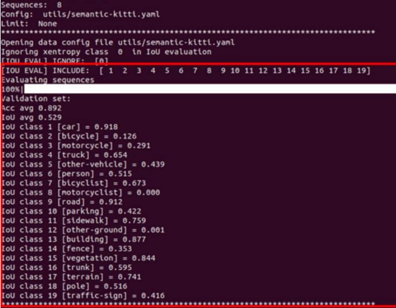
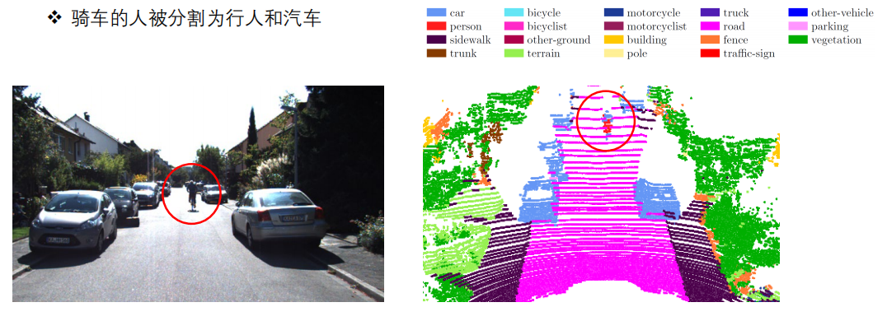
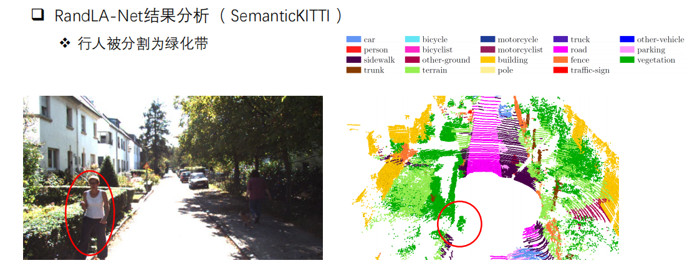

# [RandLA-Net: Efficient Semantic Segmentation of Large-Scale Point Clouds](https://arxiv.org/abs/1911.11236)

论文地址： [RandLA-Net: Efficient Semantic Segmentation of Large-Scale Point Clouds (arxiv.org)](https://arxiv.org/abs/1911.11236)

TensorFlow版地址: [QingyongHu/RandLA-Net: 🔥RandLA-Net in Tensorflow (CVPR 2020, Oral &amp; IEEE TPAMI 2021) (github.com)](https://github.com/QingyongHu/RandLA-Net)

Pytorch版地址:[tsunghan-wu/RandLA-Net-pytorch: Pytorch Implementation of RandLA-Net (https://arxiv.org/abs/1911.11236) (github.com)](https://github.com/tsunghan-wu/RandLA-Net-pytorch)

本人Github链接: [有关于环境感知方面的网络介绍及代码链接](https://github.com/Victor94-king/ComputerVersion)

## 背景介绍

语义分割任务是计算机视觉里的一个比较基础的任务，其相比于物体检测任务主要有以下几个优点：

* 输出的结果是稠密的，是针对于所有像素点的K分类问题，物体检测任务只输出前景类物体的信息忽略了背景点的信息
* 在自动驾驶任务中可以实现可行驶区域的识别，大部分区域都是以背景的形式存在，而这些背景同样是非行驶区域
* 可以输出非常精细的结果，物体检测由于输出都是刚性的矛框，对于一些精细的任务无法达到要求

---

语义分割任务在现实生活中有更大的应用场景 ，其可以大致分为三类任务：

> * 语义分割 : 对图片的每个像素点进行分类eg: 人 、车辆 、道路 、建筑物等
> * 实例分割 : 类似物体检测任务，但是输出不是矛框而是每个点的类别和实例的标签
> * 全景分割 : 语义分割 + 实例分割， 对于前景点(动态)输出每个实例的位置，大小和运动信息 ， 对于背景点(静态)输出类别信息即可，以确定可行驶的范围

而对于点云数据的语义分割任务，在此之前有PointNet 和 Point++，可以参考[搞懂PointNet++，这篇文章就够了！ - 知乎 (zhihu.com)](https://zhuanlan.zhihu.com/p/266324173) 。但是对于点云的开山鼻祖网络，其还是有很大的进步空间的，**比如说PointNet没用用到邻域的信息只用到了全局的信息，而PointNet++中层次聚类算法用于提取邻域的特征比较简单，不适用于大规模的点云数据，且聚类算法本身就比较简单，提取特征的能力有限。**RandLANet作者就提出了以下3点是普遍存在的问题

* 网络的 **降采样策略** 。现有的大多数算法采用的降采样策略要么计算代价比较昂贵，要么内存占用大。比如说，目前广泛采用的最远点采样(farthest-point sampling)需要花费超过200秒的时间来将100万个点组成的点云降采样到原始规模的10%。
* 许多方法的**特征学习模块**依赖于计算代价高的kernelisation或graph construction。
* 现有大多数方法在提取特征时 **感受野** (receptive fields)比较有限，难以高效准确地学习到大场景点云中复杂的几何结构信息

---

所以作者在RandLANet中针对上面三个问题 提出了几个解决方法:

1. 采用随机采样的策略降低计算复杂度
2. 采用级联式的局部特征聚合模块，通过逐步增加每个点的感受野来更好地学习和保留大场景点云中复杂的几何结构

## 网络结构

作者将网络结构分为两大块1.Heuristic Sampling 2. Learning-based Sampling，下面分别介绍这两大块

### Randle Sample - RS(采样模块)

作者采用随机采样的方式来替代传统的FPS 和 IDIS采样方式，并且重复4次，将点云压缩至原始数据点的 1 / 256，这样做的好处极大的降低了计算的复杂度使得原本复杂度为O(n²) 的算法降低至 O(1)，下图有RandLANet和PointNet++算法的时效对比

### Local Feature Aggregator - LFA(特征提取模块)

为了弥补随机采样带来的更多的信息损失，作者提出了一个相比于之前pointNet++利用聚类提取特征的更好的更正提取算法，可以拆分为三块内容:

1. > 局部空间编码：Local Spatial Encoding
   >
2. > 注意力池化：Attentive Pooling
   >
3. > 扩张残差模块：Dilated Residual Block
   >

#### 局部空间编码：Local Spatial Encoding

1. 首先输入的是(N , 3+d)代表的是N个点， xyz坐标 + d维特征: PS：这里的input可以是每次模块的初始输入，也可以代表的是网络的初始输入。
2. 对于N个点进行k近邻的搜索，其每个点都能找到对应的(K , 3 + d)个近邻用于表示这个点
3. 将步骤2的k个近邻的空间信息显示的空间编码后输入给MLP，并且将维度调整至与特征相同的维度。其中可以表示为第i个点的空间特征拼接上k近邻的空间特征拼接上k近邻与第i个点的相对偏移和其欧式距离
4. 将步骤3的空间位置编码与步骤2中的特征拼接，作为下一阶段的输入

#### 注意力池化：Attentive Pooling

在上一步中的N个点由每个点由k个近邻来表示，我们还需要进一步将这K个点的维度给去掉，这里就用到了注意力模块。

1. 上一步的整合后的空间特征(K, d)拼接特征特征(K , d) 在经过一个MLP并经过softmax后得到了一个注意力权重，与原始输入相互做点积后得到加权后的(K, 2d)
2. 经过一个池化以及一个MLP升维后，最终得到一个(1 , d')的向量，这个就是第i个点整合了k近邻的信息表示

#### 扩张残差模块：Dilated Residual Block

这里扩张残差模块就是重复2次的空间编码 + 注意力池化模块。最终将原始点的特征 (N , 2dout) + 增强后的点的特征( N , 2dout) 合并后，得到最终的LFA模块的输出。

**这里关于感受野的不断扩大，可以从上图看出来，由于是级联的K近邻的整合，所以通过2次特征增强后，现在的一个点其实代表了原始 k²个点的特征。**

---

**最终的网络的结构如下：**

可以看到这里经过了4次级联的 RS + LFA模块，将模式点云降低至256分之一的规模。 并且类似于Unet的结构，每次下采样后，都利用short-cut连接到上采样的特征图上，从而最后恢复原始点云的大小。

**总结： ramdom sample 极大的提高了计算效率，而为了弥补RS所带来的信息所示，作者提出的LFA模块将领域的空间和特征信息整合进了采样的点中，从而降低了信息的损失。**

## 损失函数

这里不多赘述，由于分割任务也是一个样本不均匀的任务，所以这里为了平衡各类样本中的数据大小带来的影响。采用了balanced CE. 当然了也可以利用Focal_Loss，这里可以参考[focal loss 通俗讲解 - 知乎 (zhihu.com)](https://zhuanlan.zhihu.com/p/266023273)

## 效果

这是在SemanticKITTI数据集07和09做训练，然后在08数据集做验证的效果，可以看到mIOU可以达到0.529，同样的也是Car类效果很不错，但是训练集中出现样本少的，且本身点云数据占比就少的类别效果就一般。

## 失败case分析与提升

原因 & 提升:

1. 骑车的人数据集里出现较少 -> 数据增强 ， 增加改类别的损失函数中的权重 ，
2. 骑车的人本身尺寸较小 -> 结合物体检测的效果所融合

   

原因 & 提升:

1. 多次的随机采样和K近邻操作使得行人信息带有了绿化带的信息，容易和背景所混淆 -> 适当降低采样次数 ， 与图像的信息相融合 ，时序信息融合区分动态和静态的点

---

本文主要参考:

[[CVPR 2020 Oral] RandLA-Net:大场景三维点云语义分割新框架（已开源） - 知乎 (zhihu.com)](https://zhuanlan.zhihu.com/p/105433460)

[困难样本（Hard Sample）处理方法 - 知乎 (zhihu.com)](https://zhuanlan.zhihu.com/p/103477343)

[focal loss 通俗讲解 - 知乎 (zhihu.com)](https://zhuanlan.zhihu.com/p/266023273)
