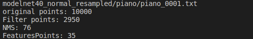
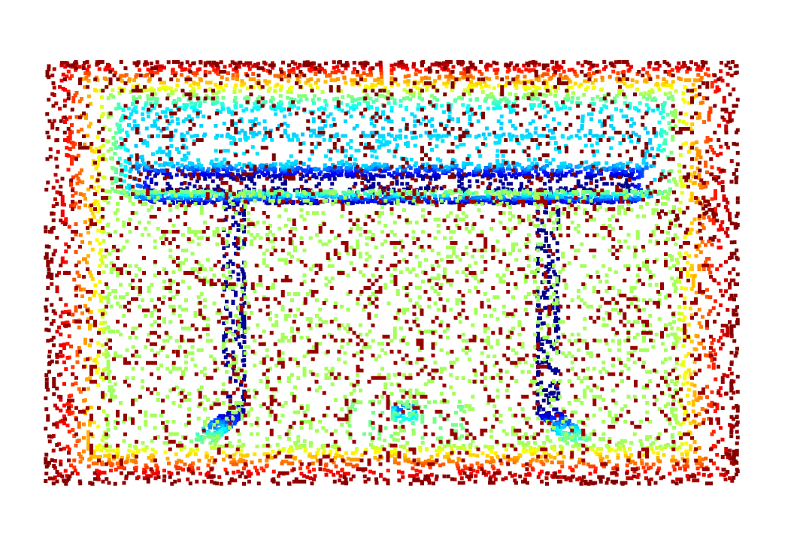
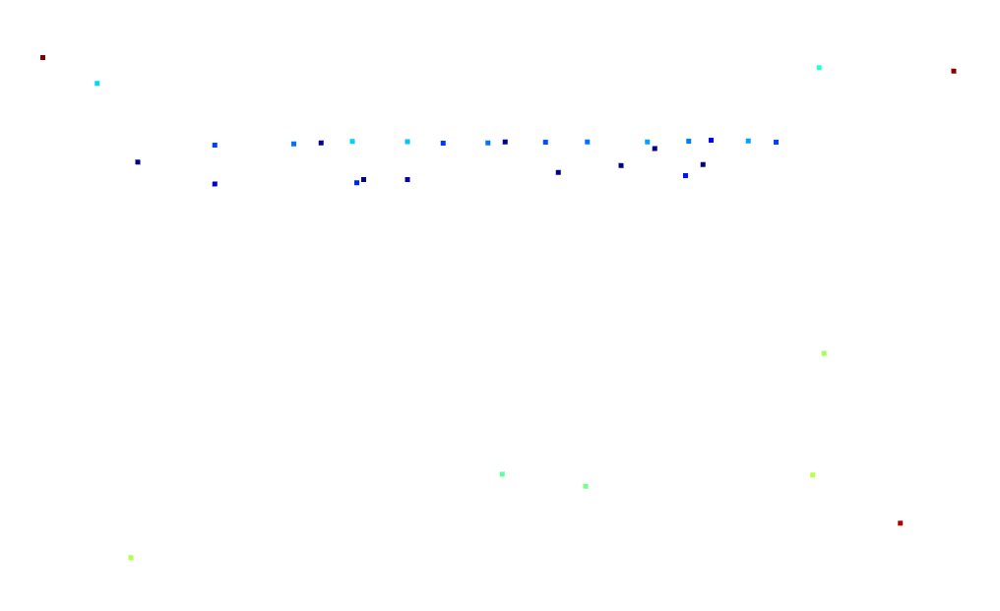
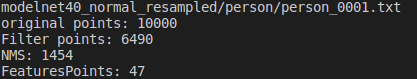
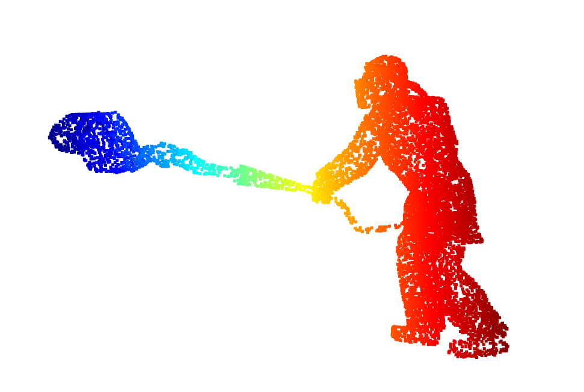
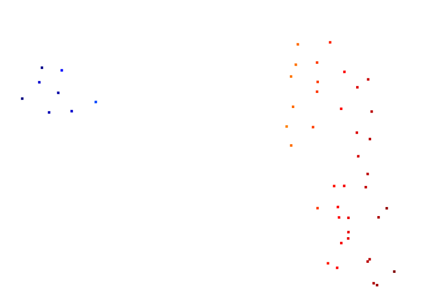

# 点云特征提取算法之ISS深度解读

代码链接 : [ISS](https://github.com/Victor94-king/ComputerVersion/blob/main/%E7%82%B9%E4%BA%91%E8%A7%86%E8%A7%89%E6%84%9F%E7%9F%A5/%E7%9B%AE%E6%A0%87%E6%A3%80%E6%B5%8B%E4%BB%BB%E5%8A%A1/ISS/ISS.py)

Github链接：[有关于环境感知方面的网络介绍及代码链接](https://github.com/Victor94-king/ComputerVersion)


特征点的定义参考这篇博文[角点（corner point）、关键点(key point)、特征点(feature point)](https://blog.csdn.net/yizhang_ml/article/details/86994193):

> 在图像处理中，所谓“特征点”，主要指的就是能够在**其他**含有相同场景或目标的**相似图像**中以一种**相同的或至少非常相似的不变形式**表示 **图像或目标** ，即是对于**同一个**物体或场景， **从不同的角度采集多幅图片** ，如果相同的地方能够被识别出来是相同的，则这些点或块称为特征点。

<br />


如上图，两张不同的图之间的特征点的描述和匹配，可以用来做三维重建，姿态估计，全景图的构造以及SLAM的应用，具有极大的发展前进。

<br />

在深度学习普及之前大部分都是由传统算法提取特征点，如下图，传统算法的代表主要由通过图像特征的Harris 算法， SUSAN算法 以及SIFT ，还有基于3D点云特性本身的ISS算法。本文主要以介绍ISS算法为主


深度学习没有普及主要原因: 特征点的描述比较模糊，可能由观察的角度决定eg去观察一辆车的时候，轮胎上的花纹可能是特征点，但是当观察角度变成整条马路上所有车之后，这些花纹就不再是特征点了。所以导致特征点的定义模糊，所以导致没有现成的数据集，所以目前的都是一些无监督的方法。

<br />

<br />

## 算法简介

ISS是直接针对于点云数据的特征提取方法，其思想的核心在于PCA分解之后，其最小的特征值必须要足够大。基于这个思想我们对算法进行介绍:

1. 对点云的每个点遍历，计算其RadiusNN

   <br />
2. 每个点根据其RadiusNN表示，并由其R近邻点计算加权的协方差矩阵

   1. 权重wj构建的思想基于: 稀疏部分的点云的权重大于密集部分的点云权重,所以定义如下对于任意一个近邻点j，其对应的矩阵与点j的R近邻的个数成反比

      
   2. 最终的加权协方差矩阵定义如下:

      

      <br />
3. 对协方差矩阵进行特征值分解，分别计算λ1,λ2,λ3,降序排序

   <br />
4. 计算完所有点的特征值后，进行过滤，过滤条件如下其中γ21 和 γ32都是超参数根据实验进行调整，其大致意思可以理解成，不仅仅需要λ3的值足够大，且需要λ1 λ2 和λ3个不相等:

   
5. 对λ3进行NMS(非极大值抑制)

   1. 根据λ3按照降序排序
   2. 取出λ3最大值作为参考点，并加入最终的结果中
   3. 对propose的点里去除掉与参考点距离小于r的点
   4. 重复步骤23，直至propose里所有点遍历完，取出最终结果则完成了NMS过程

<br />

<br />

<br />

## 代码实现

这里放了几个核心代码,具体代码参考github:

### ISS初始化

```
    def __init__(self, pc , radius = 0.1, gama21 = 0.7 , gama32 =0.7 , min_lambda3 = 0.0008, min_neighbors = None):
        self.pc = pc #o3dpc
        self.tree = o3d.geometry.KDTreeFlann(pc) # KDTree
        self.point_clound = np.asarray(pc.points) 
        self.num_points = self.point_clound.shape[0]
        self.radius = radius # 计算特征点的直径
        self.gama21 = gama21
        self.gama32 = gama32
        self.min_lambda3 = min_lambda3
```

初始化涉及到几个超参数，包括**radius , γ21 , γ32 和最小λ3的设置 以及最小近邻点**的设置。

### 计算特征值

```
    def cal_eigen(self , point , idx_neighbors , w):
        #计算根据记录的加权的radius近邻协方差矩阵
        w = 1 / np.array(w) # K
        dis = self.point_clound[idx_neighbors] - point #每个点距离query_point的相对距离 , K * 3
        conv = np.dot((dis.T * w), dis) / w.sum() # 与其相对距离成反比，与其周围点的个数成反比
        #计算特征值
        values, v = np.linalg.eig(conv)
        values  = values[np.argsort(values)[::-1]]
        return values
```

这里实现的是加权的协方差矩阵的构造，对每个点计算其近邻点，然后每个近邻点计算近邻点的个数，从而得到权重为个数的倒数，最终乘以L2距离，得到协方差矩阵。

<br />

### NMS实现

```
    def NMS(self):
        #对特征点按照lambda3的值进行排序
        tmp = pd.DataFrame(self.points_eigns)
        start = len(tmp)
        tmp.sort_values('l3' ,ascending=False, inplace=True)
        tmp = tmp['id'].to_numpy().tolist()

        res = [] #用于保存最后的id
        # print(len(self.radius_neighbor))
        while (tmp):
            #取出lambda3最大的点,并加入结果中，还需要删除掉自身
            query_id = tmp[0] 
            res.append(query_id)
            tmp.remove(query_id)

            #找到query点的Rnn近邻，如果出现在tmp中全部删除
            rnn_list = self.radius_neighbor[query_id]
            jiaoji = set(tmp) & set(rnn_list) 

            for i in list(jiaoji):
                tmp.remove(i)
  
        #更新下特征点的id
        self.points_eigns['id'] = res
        end = len(res)
        print("NMS: %d"%( start - end))
```

<br />

有关NMS步骤上面讲的比较清楚，这里类似物体检测里的NMS，通过λ3对应置信度过滤掉propose ，通过计算r近邻对应IOU过大过滤掉同一物体，最终对于聚集密集的特征点有且仅取出一个点。

<br />

<br />

<br />

## 效果

数据集来自[modelnet40](https://blog.csdn.net/Shertine/article/details/124091578) , 下面展示几个demo

### Piano

可以看到点云从1000 -> Filter(2950) -> NMS(35),整体效果我觉得还可以,保留的特征点也比较多，参数就不细调了








### Person

可以看到点云从1000 -> Filter(6490) -> NMS(47),对于人这种不是特别规则的形状，效果我觉得差一点，如果不看原图很难恢复。









<br />

<br />
