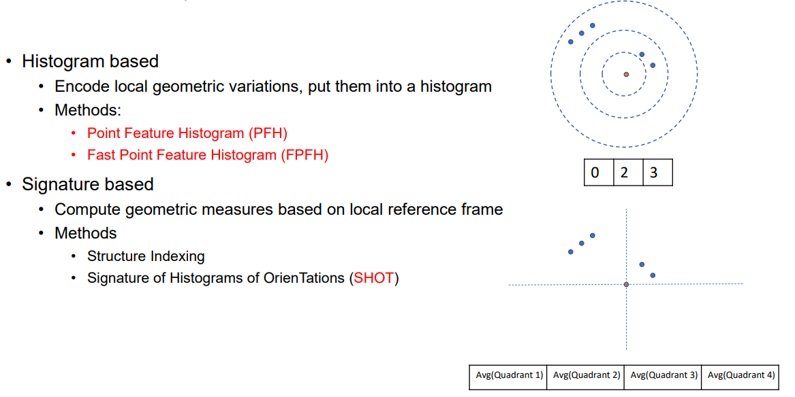
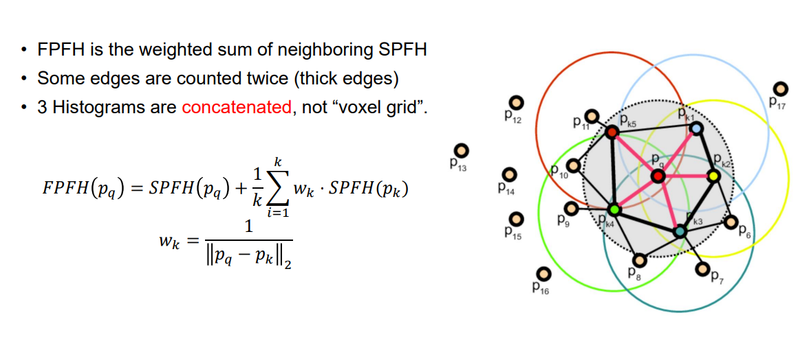
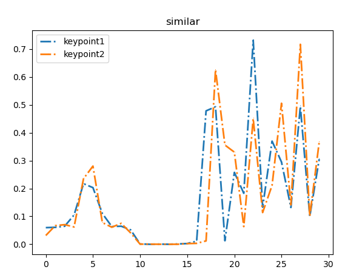

# Feature Description特征描述 - PFH & FPFH算法

## 1. 背景

上一章介绍了点云的[特征提取](https://blog.csdn.net/victor_manches/article/details/130417018?spm=1001.2014.3001.5502)ISS算法 ，对于提取每帧图片后的任务就是进行特征描述，对于同样的物体，将其进行旋转和平移其特征描述值应该不变性。 传统的方法有两种主流算法 , :

1. Histogram based , eg PFH & FPFH (本文主要介绍)
2. Signature based , eg SHOT

除此之外还有深度学习方法，比如3DMatch ， PerfectMatch ， PPFNet & PPF-FoldNet等




<br />


<br />


<br />


## 2. 算法简介

### PFH

1. 通过特征提取算法找到特征点(代码里的特征点是直接由ISS算法提取到的2个点)
2. 计算特征点的radius近邻，然后计算所有点两两之间的6D pose(u , v , w , α , Φ , θ),下面是计算任意两点p1 & p2之间的6D pose算法 , 其中n1 和 n2 分别是 p1 和 p2点的法向量
   * u = n1
   * v =  u X $p2 - p1 \over ||p2 - p1|| $
   * w = u X v
   * ~~d = $  ||p2 - p1||$  (受传感器远近影响，所以一般舍去)~~
   * α = v · n2
   * Φ = u · $p2 - p1 \over ||p2 - p1||$
   * θ = arctan(w · n2 , u · n2)
3. 对于quiry的k个近邻，理论上应该有k² 个三元组[α , Φ , θ]，将这k²个三元组关系放入B个直方图中(voxel grid),最终得到特征点的描述(代码里是直方图做拼接而不是做voxel grid)


<br />


<br />


### FPFH

FPFH实际上是PFH的一种改进，主要是

1. 通过特征提取算法找到特征点(代码里的特征点是直接由ISS算法提取到的2个点)
2. 计算query点的SPFH特征(SPFH特征与PFH不同的是只计算query点与近邻点的pari，而不是所有的两两pair)
3. 计算特征点的radius近邻，并且计算每个近邻点的SPFH特征
4. 计算最终的FPFH特征，是一个加权的特征其公式如下图，其中权重与近邻点到query点的距离成反比

   

<br />


<br />


<br />


<br />


## 3. 代码实现

代码实现放在了git上:

对于PFH的话核心在于计算所有两两之间的特征这个体现在了PFH.cal_group函数中:

```
    def cal_group(self , idx_neighbors , id):
        # idx_neighbors.append(id) #把quiry点加入到整个近邻里
        alpha_group ,phi_group , theta_group = [] ,[] , []

        for id1 in idx_neighbors:
            for id2 in idx_neighbors:
                if id1 == id2:#跳过自己本身
                    continue
                afa , fai , the = self.cal_pair(id1, id2)

                alpha_group.append(afa)
                phi_group.append(fai)
                theta_group.append(the) 
        # print(len(alpha_group) , len(phi_group) , len(theta_group))

        alpha_hist , _ = np.histogram(alpha_group , self.B )
        phi_hist , _   = np.histogram(phi_group   , self.B )
        theta_hist , _ = np.histogram(theta_group , self.B )

        feature = np.hstack((alpha_hist , phi_hist , theta_hist)) / len(alpha_group) #由于每个query的点的近邻个数不一样所以需要归一化
        return feature
```


<br />


<br />


而对于FPFH，核心是计算SPFH特征，其在FPFH.cal_SPFH函数中:

```
    def cal_SPFH(self , id:int):
        [num_neighbors, idx_neighbors , dis_neighbors] = self.tree.search_radius_vector_3d(self.array[id],self.radius)
        query = self.array[id]
        neigbhors = self.array[idx_neighbors[1:]]
  
        #计算n1 , n2 ,以及dis
        n1 = self.normal[id]
        n2 = self.normal[idx_neighbors[1:]]
        dis = (neigbhors - query) / np.linalg.norm((neigbhors - query) , ord = 2)

        #计算u , v , w
        u = self.normal[id]
        v = np.cross(u , dis)
        w = np.cross(u , v)

        #计算其3个夹角alpha , phi , theta
        afa = (v * n2).sum(axis = 1)
        fai = (u * dis).sum(axis = 1)
        the = np.arctan2((w * n2).sum(axis = 1),(u * n2).sum(axis = 1))
  
        #计算alpah , phi , theta 的直方图
        alpha_hist , _ = np.histogram(afa , self.B)
        phi_hist , _   = np.histogram(fai , self.B)
        theta_hist , _ = np.histogram(the , self.B)

        spfh = np.hstack((alpha_hist , phi_hist , theta_hist)) / (num_neighbors - 1) #由于每个query的点的近邻个数不一样所以需要归一化
        return spfh
```

以及计算加权的FPFH特征:

```
        for id in feature_id:
            #计算query点的SPFH特征
            query_SPFH = self.cal_SPFH(id)

            #计算query近邻的SPFH特征
            [k, idx_neighbors , dis_neighbors] = self.tree.search_radius_vector_3d(self.array[id],self.radius) #计算query点的近邻
            weight = 1.0 / np.linalg.norm(self.array[id] - self.array[idx_neighbors[1:]] , ord = 2 , axis = 1) # 权重
            neighbors_SPFH = np.array([self.cal_SPFH(i) for i in idx_neighbors[1:]]) # 近邻的SPFH
          
            #计算query点的FPFH，并归一化
            query_FPFH = query_SPFH + np.dot(weight.reshape((1,-1)) ,neighbors_SPFH).reshape(-1)  / (k - 1)
            query_FPFH = query_FPFH / np.linalg.norm(query_FPFH)
          
            self.feature_list.append(query_FPFH)
```

<br />


<br />


<br />


## 4. 效果

最后的效果由matplotlib表示,这里的B = 10，所以最后维度都是30维，可以看到无论是PFH还是FPFH对于同样类型的特征点的描述还是很类似的。

### PFH



### FPFH


