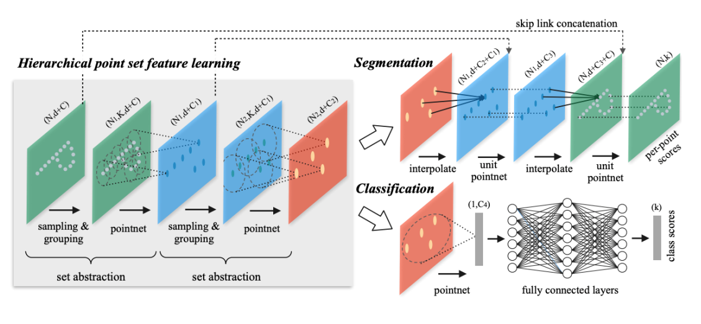
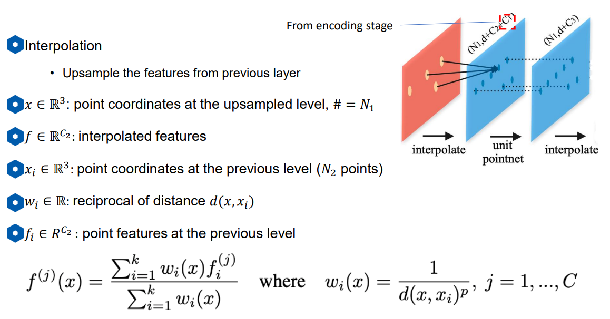
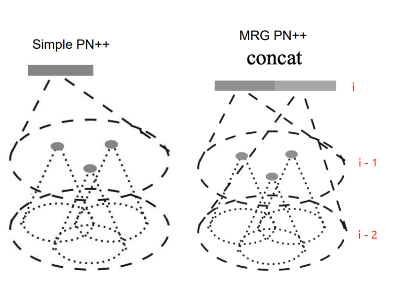
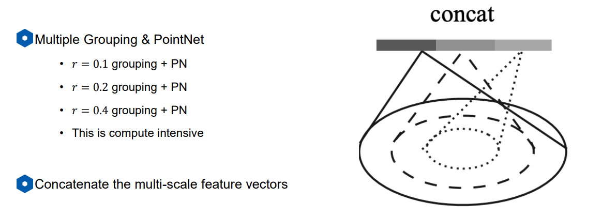

# 点云检测算法之PointNet++深度解读

论文链接 : [PointNet++: Deep Hierarchical Feature Learning on Point Sets in a Metric Space](https://arxiv.org/abs/1706.02413)

Github链接：[有关于环境感知方面的网络介绍及代码链接](https://github.com/Victor94-king/ComputerVersion)

 

## 背景和亮点

### 背景

有关于PointNet缺点，可以参考我上一篇文章[ComputerVersion/PointNet.md at main · Victor94-king/ComputerVersion](https://github.com/Victor94-king/ComputerVersion/blob/main/%E7%82%B9%E4%BA%91%E8%A7%86%E8%A7%89%E6%84%9F%E7%9F%A5/%E7%9B%AE%E6%A0%87%E6%A3%80%E6%B5%8B%E4%BB%BB%E5%8A%A1/PointNet.md) , 我觉得最主要的在于其利用了maxpooling 整合了全局的信息，但是没有利用邻域的信息，基于此，PointNet++就针对领域信息的提取做出了改善。

1. point-wise MLP，仅仅是对每个点表征，对局部结构信息整合能力太弱 --> **PointNet++的改进：sampling和grouping整合局部邻域**
2. global feature直接由max pooling获得，无论是对分类还是对分割任务，都会造成巨大的信息损失 --> **PointNet++的改进：hierarchical feature learning framework，通过多个set abstraction逐级降采样，获得不同规模不同层次的local-global feature**
3. 分割任务的全局特征global feature是直接复制与local feature拼接，生成discriminative feature能力有限 --> **PointNet++的改进：分割任务设计了encoder-decoder结构，先降采样再上采样，使用skip connection将对应层的local-global feature拼接**

---

 

 

## 网络结构

这里的网络使用的是典型的encoder - decoder 结构， 先用过级联的set-abstraction 不断的扩大点云感受野，最后的点云大小由最开始的N downsample至聚合了邻域信息的N'个点，特征也从最开始的d + C维度变成了d + C'维度 。 再通过各自的Decoder结构从而实现分类和分割的任务。下面会从分别介绍Encoder 和 Decoder结构

### Encoder

encoder部分可以看成是N个级联的set abstrction组合，其中又可以细分成以下结构:

1. Sampling : FPS (最远点采样)，对点集进行降采样，将输入点集从规模 N1 降到更小的规模N2 。FPS可以理解成是使得采样的各个点之间尽可能远，这种采样的好处是可以降采样结果会比较均匀。**FPS实现方式如下** ：随机选择一个点作为初始点作为已选择采样点，计算未选择采样点集中每个点与已选择采样点集之间的距离distance，将距离最大的那个点加入已选择采样点集，然后更新distance，一直循环迭代下去，直至获得了目标数量的采样点。这里由之前的(N , d+C)特征,其中N代表点的个数， d 和 c分别代表每个点的三维坐标以及c维特征。 下采样至 (N' , d+C)维。
2. Grouping: 将采样后点的点作为中心与未采到的点进行进行聚合，为了整理成batch所以会要求每个中心group的话包含相同个数的K个点，所以对于grouping有以下两种方式，然后这里变成了(N' , K , d + C)维 :
   1. KNN
   2. Radius NN + random sample
3. PointNet: 上一步的特征已经变成了每个downsample的点都带了其K近邻的特征，随后我们通过一个mlp将这K个点的特征由d + C维 转变成 d + C'维并且去除了K
   这个维度。(另外为了去除绝对距离带来的影响，这里的d的空间信息，是每个group里的点相对于其中心点的相对距离，即d  = d - d（center)  ）
4. 重复多次结构123组合，从而实现感受野的不断扩张, 从图上就可以看出最后橙色图片上的一个点就代表了最开始蓝色图片上的N个点的信息。

 

 

### Decoder

在得到具有语义特征的特征后，分类网络与原始pointnet一样做mlp然后去分类，这里就不赘述了。而对于分割网络，作者借鉴了2D网络的结构，通过一系列的跨层连接进行特征融合，除此之外，作者在这里还提出了interpolation，简单的理解就是将原始特征图上的点 ，根据距离大小加权平均从而得新的点的特征从而恢复到原始特征图点云大小数量的特征。

 

 

---

## 改进

### MRG (深度融合)

除了原始的pointNet++，作者还提出了两种不同的改进方法，上图就是MRG(multi-resolution grouping)。可以看出原始的point特征就是由上一层的点云进行特征提取，而MRG就是从深度上进行拓展，不仅看了上一层的特征还加上了上两层的特征进行提取，提取后的特征进行拼接。这样的精度会有提升，同样的速度也会降低。

### MSG(广度融合)

还有一种改进思路就是MSG(Multi-scale grouping) 广度融合，从上图可以看到这里每次融合的特征的r范围r, 由不同的范围拼接而成，从而提高精度。

参考文献: [搞懂PointNet++，这篇文章就够了！ - 知乎 (zhihu.com)](https://zhuanlan.zhihu.com/p/266324173)
