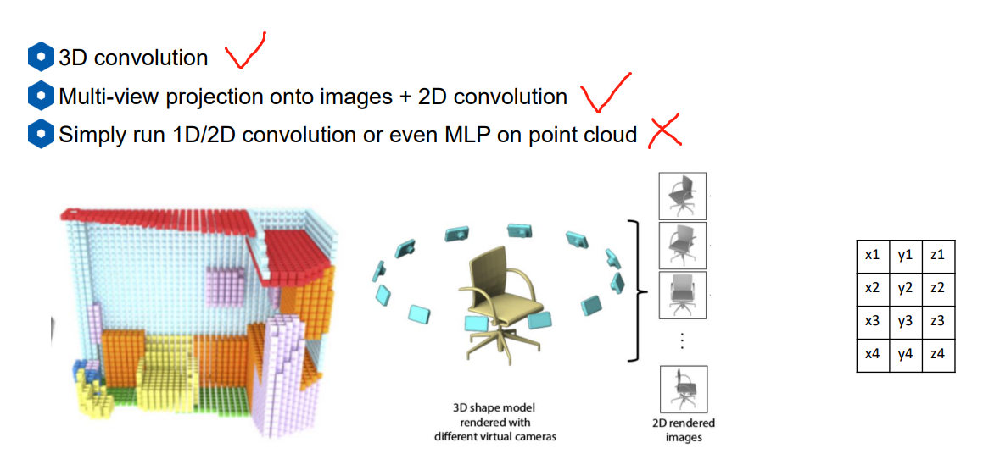
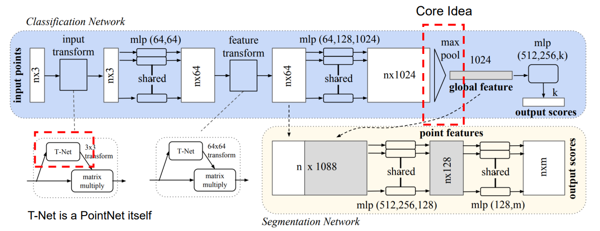
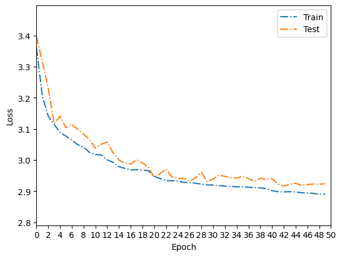
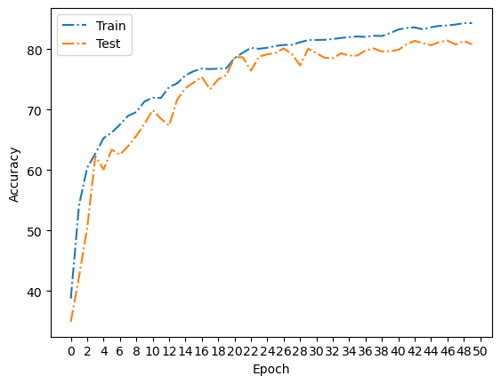

# 点云检测算法之PointNet深度解读

论文链接 : [PointNet: Deep Learning on Point Sets for 3D Classification and Segmentation](https://arxiv.org/abs/1612.00593)

代码链接 : [PointNet Pytorch](ttps://github.com/fxia22/pointnet.pytorch)

Github链接：[有关于环境感知方面的网络介绍及代码链接](https://github.com/Victor94-king/ComputerVersion)

<br />

## 背景和亮点

### 背景

有关于点云的介绍可以参考[3D点云基础知识](https://zhuanlan.zhihu.com/p/344635951)， 总结的来说，点云数据的处理已经成为了3D视觉中必不可少的一部分。其数据相比于2D图像，本身有着先天不需要的特征变换的优势。

点云数据有着以下的特点:

1. **无序性 --> 对称函数设计用于表征**
2. **点不是孤立的，需要考虑局部结构 --> 局部全局特征结合**
3. **仿射变换无关性 --> alignment network**

<br />

<br />

所以，在初期对于点云数据的处理方式主要有下面三种:

1. 直接利用3D卷积进行处理，这里的代表有 Volumetric CNNs ， VoxNet 等，但是这种做法的缺点在于(a)3D卷积运算量较大(b)点云本身数据比较稀疏，所以3D卷积浪费资源
2. 利用多个方向的2维投影，加上2D卷积进行处理，这里的代表作有Multiview CNNs ，但是这种做法的话同样需要认为(a)设定不同的投影角度 以及(b)运算量大的缺点
3. 直接将所有点stack起来投入一个MLP，这里的代表作有PointCNN ， 这种做法的缺点就是随着stack的顺序不同，结果也完全不同，所以这种做法取的比较少。



<br />

### 亮点

我个人认为pointnet有以下几个亮点：

1. PointNet是一个完整的深度神经网络，并且可以同时处理三维图形分类、图形的局部分割以及场景的语义分割等任务
2. 整合了全局和局部的特征。

## 网络结构



首先对于一个N * 3 的点云数据，通过一个T-Net(这个目前已经没人用了，感兴趣的可以自己去了解下) ， 3维的数据通过几个共享权重的mlp ，这里可以看成是升维从3维数据升高至最终的1024维信息，**然后是PointNet核心:  通过对这N个点的1024维的数据做maxpooling,  从而代表全局特征信息的1024个点的信息。** 最终再经过几个mlp从而达到分类的任务。

而对于语义分割的任务，由于其是point-wise feature ,  所以需要融合局部和全局的特征，这里PointNet就直接将1024 维提的全局信息 复制 N份直接拼接上之前的N * 64维的数据，得到一个N * 1088维度的信息，再通过一系列的mlp 从而将1088维的信息 降低到m类里。

从这里就可以发现PointNet的核心其实就在于提取全局特征的max_Pooling，而对于语义分割任务来说，其只结合了全局的信息，并没有整合邻域的信息(这个在pointnet++上有体现)。

<br />

除了上面这些作者结合点云数据的特征，还做了一些trick:

1. 对于样本采用了随机DownSample， 因为取局部像素不影响分类任务，有点类似图像的Crop
2. 数据坐标点加入了高斯噪声以及旋转(z轴)，相当于做了数据增广

而对于损失函数，这里分类任务就用了比较简单的交叉熵损失函数。

<br />

<br />

---

## 代码复现

源码链接: [源代码Git连接](https://github.com/Victor94-king/ComputerVersion/tree/main/%E7%82%B9%E4%BA%91%E8%A7%86%E8%A7%89%E6%84%9F%E7%9F%A5/%E7%9B%AE%E6%A0%87%E6%A3%80%E6%B5%8B%E4%BB%BB%E5%8A%A1/PointNet)

数据连接: [MobelNet40](https://shapenet.cs.stanford.edu/media/modelnet40_normal_resampled.zip)

本人实现了一个简易版的PointNet的分类版本，其核心网络代码如下：

```
class GlobalFeatures(nn.Module):
    def __init__(self) -> None:
        super(GlobalFeatures , self).__init__()
        #考虑的全局特征所以用Conv
        self.conv1 = nn.Sequential(nn.Conv1d(3 , 64 , 1) , nn.BatchNorm1d(64) , nn.ReLU() )
        self.conv2 = nn.Sequential(nn.Conv1d(64 , 128 , 1) , nn.BatchNorm1d(128) , nn.ReLU())
        self.conv3 = nn.Sequential(nn.Conv1d(128 , 1024 , 1) , nn.BatchNorm1d(1024) , nn.ReLU()) 

    def forward(self, x):
        x = self.conv1(x) # B * 64 * N
        x = self.conv2(x) # B * 128 * N
        x = self.conv3(x) # B * 512 * N
        x = torch.max(x, 2, keepdim=True)[0]
        x = x.squeeze() 
        return x


class PointNet(nn.Module):
    def __init__(self , class_num ) -> None:
        super(PointNet , self).__init__()
        self.class_num = class_num
        self.globalExtra = GlobalFeatures()
        self.fc1 = nn.Sequential( nn.Linear(1024 , 512) , nn.BatchNorm1d(512) ,nn.ReLU())
        self.fc2 = nn.Sequential( nn.Linear(512 , 256) , nn.Dropout(0.3), nn.BatchNorm1d(256) , nn.ReLU())   
        self.fc3 = nn.Sequential( nn.Linear(256 , class_num)  , nn.Softmax(dim=1) )
  
    def forward(self, x):
        x = self.globalExtra(x)  # B * 1024 
        x = self.fc1(x) # B * 512 
        x = self.fc2(x) # B * 256
        output = self.fc3(x) # B * K
        return output


```

以及在上一节中提到的几个数据增广的Trick的实现:

```
        #data_augmentation
        if self.data_augmentation :
            theta = np.random.uniform(0, np.pi * 2)
            rotation_matrix = np.array([[np.cos(theta), -np.sin(theta)], [np.sin(theta), np.cos(theta)]])
            point_set[:, [0, 2]] = point_set[:, [0, 2]].dot(rotation_matrix)  # random rotation ? 绕着Y轴转?
            point_set += np.random.normal(0, 0.02, size=point_set.shape)  # Gaussian jitter jitter
```

<br />

## 结果

这里跑了50个epoch的结果曲线如下,最终在测试集上的准确率为 80.8 ,但是可以看出来，还是可以继续训练的。




