# [PointPillars: Fast Encoders for Object Detection from Point Clouds](https://arxiv.org/abs/1812.05784)

Github链接：[有关于环境感知方面的网络介绍及代码链接](https://github.com/Victor94-king/ComputerVersion)

## 背景和亮点

这是一篇来自19年工业界的文章，在此之前对于不规则的稀疏的点云的做法普遍分为两派:

1. 将点云数据量化到一个个Voxel里，常见的有VoxelNet 和SECOND , 但是这种做法比较普遍的问题是由于voxel大部分是空集所以会浪费算力(SCOND利用稀疏卷积解决了它) ，但是二者都还存在高度的信息所以还需要计算三维卷积的。
2. 从俯视角度将点云的数据进行处理，将高度信息通过一系列手段去除从而获得一种类似Pseudo image的方式从而去用一些经典的图像网络去处理一些任务比如，MV3D和AVOD

本文也有点类似上面的思想2，**pointPillar下文简称PP**. 有以下几个明显的亮点

1. 是一种结合了点试图思想(忽略非空区域)以及俯视图(量化2D平面而得到伪图片)的点云融合感知算法
2. 速度和精度的trade-off，平均速度达到了62Hz，最快达到了105Hz，下面是CIA-SSD中的精度&速度图

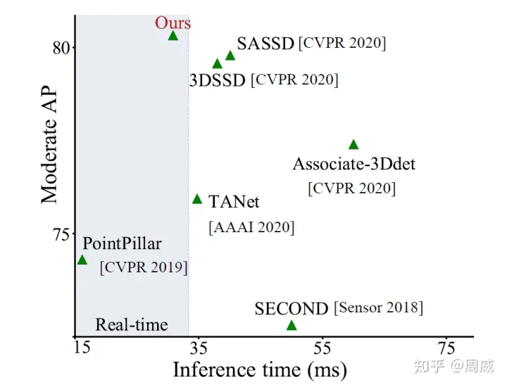

## 网络结构

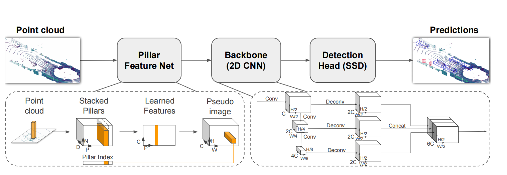

上图是PP网络的图示可以看到作者将网络分成了3大块

* **Point Feature Ne**t

  * 输入的原始点云特征，在X-Y 平面网格化，

    * 一个网格 = 一个pillar ， 且97%的pillar都为空
  * 每个点采用9维特征表示

    * x, y , z, r, xc , xy , xz ,xp , yp (xyz:笛卡尔坐标，r:强度 ,xc / yc / zc : pillar中所有点云数据的中心, xp / yp : 点与pillar中点的差距 )
  * Pillar 的表示(P ,N , D )

    * 每个pillar用(P ,N , D )表示，其中D  = 9 ，N = pillar中点的数量 (如果pillar中点超过了N就random sampling 如果少了就补0)， P = 非空pillar的数量
  * Pillar 提取点的特征

    * (P , N , D) -> (P , N , C) 通过MLP
    * (P , N , C) -> (P ,C) 通过对N个点进行maxpooling，从而代表整个pillar的信息
  * Pillar 映射回X-Y 平面

    * (P , C) + Pillar_index -> (H , W , C) 得到一个通道数为c的伪图片,从而就可以开始利用经典的图像网络了！！！
* **[FPN](https://zhuanlan.zhihu.com/p/92005927) &[ SSD](https://zhuanlan.zhihu.com/p/33544892)**

  现在在目标检测的领域的基本上是标配，主要解决的问题就是多尺度变换的不足，高层的特征虽然包含了丰富的语义信息，但是由于低分辨率，很难准确地保存物体的位置信息。与之相反，低层的特征虽然语义信息较少，但是由于分辨率高，就可以准确地包含物体位置信息。所以FPN横空出世！

  PP同样的通过对(H , W , C) 三次下采样至8倍然后再三次上采样至(H/2 , W/2 , 2C)，然后进行Concat得到一个(H/2 , W/2 , 6C)并且分别对上采样的不同尺度的特征图进行检测的任务，这样就能解决不同分辨率对应检测不同大小的物体

## 损失函数

介绍损失函数前这里介绍下PP的Anchor的设计，由于PP是基于点云数据的俯视图的表示，所以这里初始化的矛框有着不同于图像的矛框的设计，不同于图像的远小近大的特点，点云数据拥有者几何不变性的特点，所以在这里我们可以直接利用不同类别的先验知识来初始化矛框，下面是车辆和行人的矛框的初始化。PS：虽然矛框是3D的，但是再与GT匹配的时候，只采用2D的信息

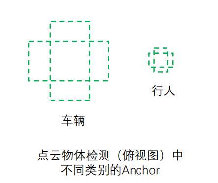

这里的损失函数类似SECOND，首先3D物体框的表示为(x,y,z,w,l,h,θ)，xyz代表的是矛框再中心点的空间坐标，whl代表的是矛框的长宽高,θ代表的是物体的方向，作者将损失函数分成了三类,对应的β是各类损失的权重是一个超参数可以自由选择如下图:

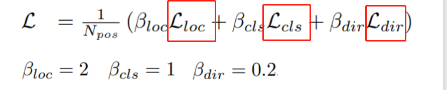

1. Loc代表的是物体框位置的回归的损失，这里可以看到Δ里进行了归一化，这是因为对于目标较大的物体其中心点的偏移可能也会越多，所以进行归一化去除了目标大小的影响，而最终的loss属于对所有方位的loss求smoothL1 Loss的和，而其是结合了L1和L2的部分优点(即在预测和gt差别较小的时候，梯度不至于太大相比于L1更加圆滑，反之则梯度足够的小不会像L2一样产生梯度爆炸的问题):

   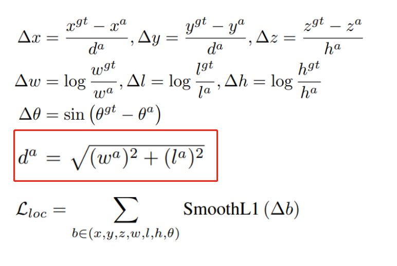
2. cls代表的是物体分类的损失，这里仍采用了[Focal Loss](https://zhuanlan.zhihu.com/p/266023273 "https://blog.csdn.net/BIgHAo1/article/details/121783011")，也是为了解决图像领域正负样本不均衡，解决了样本少的类别分类准确率不高的问题，当然难分样本不限于样本少的类别，也就是focal loss不仅仅解决了样本非平衡的问题，同样有助于模型的整体性能提高。~~作者也采用了kaiming大神的超参数原值，看的出来是很respect他了。。~~

   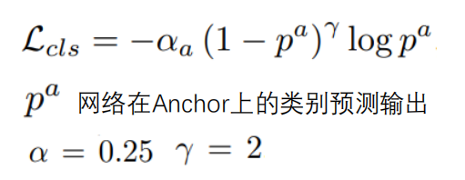

   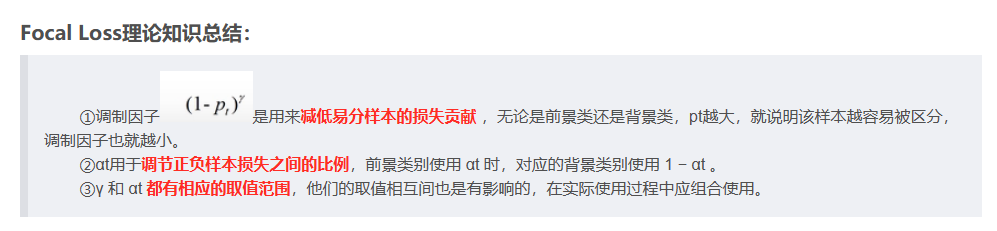

   关于如何处理难分样本除了使用Focal_loss还可以参考[困难样本（Hard Sample）处理方法 - 知乎 (zhihu.com)](https://zhuanlan.zhihu.com/p/103477343) 作者提出了**Gradient Harmonizing Mechanism: GHM** 和 OHEM ，前者其大致思想就是为了防止那种误标签，将梯度密度量化后根据其所在数量，对CE做加权平均。后者就是将难分样本进行多次训练替代原来样本里的容易样本。
3. dir代表的是物体0°与180°之间的方向差异的损失， 可以从回归的损失看到Δθ = sin(θgt - θ) ，可以看到如果二者相差180°的时候，角度的loss = 0，这在某些情况下显然不是我们想要的结果，所以这里的Ldir就是弥补了它。

## 测试结果

代码地址: [https://github.com/open-mmlab/OpenPCDet](https://github.com/open-mmlab/OpenPCDet)

下图是训练了80个epoch的car类和行人类在验证集上的结果如下:

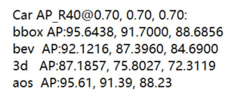

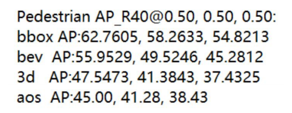

* bbox: 2D检测框的准确率
* bev: BEV视图下的准确率
* 3d: 3D检测框的准确率
* aos: 检测目标旋转角的检测率(Average Orientation Similarity 平均方向相似度 )
* 三列代表的是不同困难程度依次降低
* @ 0.7 0.7 0.7 代表的是bbox / bev / 3d评估时的IOU的阈值
* AP_R40代表的是基于40个召回位置计算的AP

## 失败case分析与提升

### False Positive

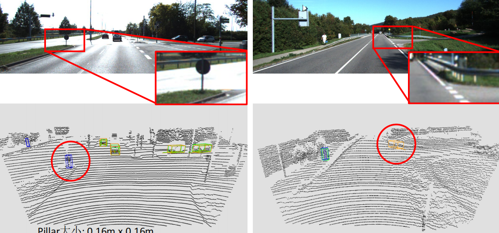

原因 & 提升:

1. pillar丢失了高度方向的信息 -> 提取不同的高度特征，类似voxel的方法
2. pillar分辨率不足，导致小目标的特征较少 -> 提高pillar的分辨率，或者采用更高线的雷达
3. 语义信息的提取不足，无法很好的理解场景 -> 多传感器融合结合语义的信息

### False Negetive

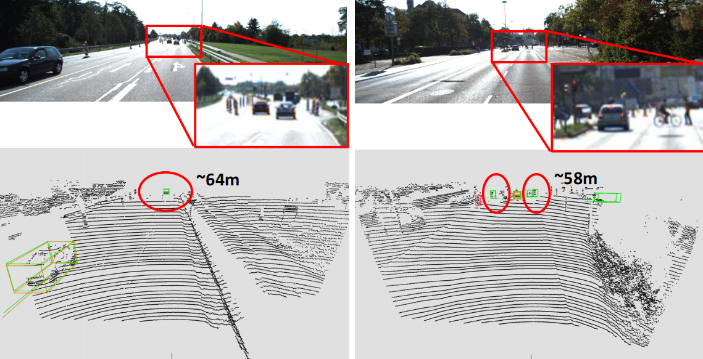

原因 & 提升:

1. 点云密度随着距离增加而降低，较远的目标点非常稀疏小目标尤其 -> 对高分辨率的特征图进行原目标的检测 & 专门采用前向的激光雷达，降低可视范围，提高线束密度

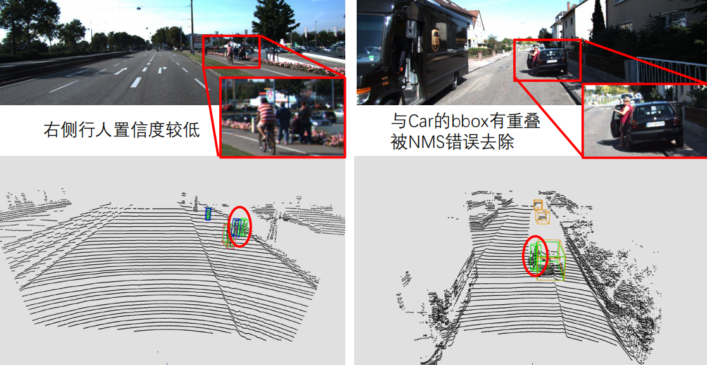

原因 & 提升:

1. 目标相距较近，网络给出的置信度较低，NMS去除 -> 采用高分辨率来检测小目标 &  每个类别单独进行NMS ，并采用不同的IOU参数 & 定义新类别一组行人 &数据增强

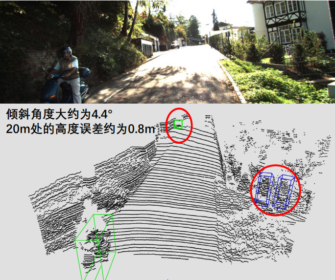

原因 & 提升:

1. 路面与激光雷达的XY坐标平面不平行，导致点云的z值无法真实反应物体高度，从而影响Pillar中的特征学习 ->通过车辆的倾斜角度以及路面的检测结果对高度进行矫正
